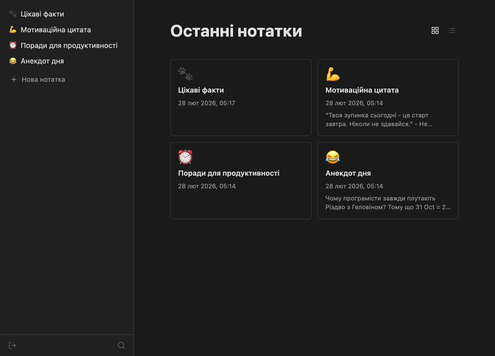
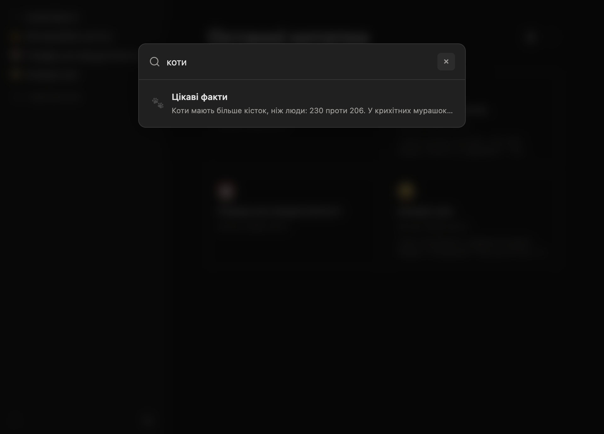

# Нотатки

Персональний сервіс для нотаток, натхненний Notion. Побудований на PHP + Twig без фреймворків, з Editor.js як блоковим редактором. Має REST API для інтеграції з ШІ-агентами (N8N, Telegram-боти тощо).

## Можливості

- Блоковий редактор (заголовки, списки, чеклисти, код, цитати, таблиці, роздільники, посилання)
- Блоки коду з підсвіткою синтаксису (One Dark тема, 18 мов, пошук по мовах)
- Inline-інструменти: жирний, курсив, підкреслення, закреслення, маркер, код
- Кольорові блоки-сповіщення (info, success, warning, danger)
- Розгортувані блоки (toggle)
- Drag-and-drop перетягування блоків у редакторі
- Undo/Redo (Ctrl+Z / Ctrl+Y)
- Вкладені сторінки (батьківські/дочірні нотатки)
- Емоджі та SVG іконки для нотаток
- Деревоподібний сайдбар з drag-and-drop сортуванням та крос-рівневим переміщенням нотаток
- Автозбереження при редагуванні
- Хлібні крихти для навігації
- Перегляд плиткою та списком на головній
- Темна та світла тема (автоматично за системною)
- Мобільна адаптивна верстка з бургер-меню
- PWA — встановлюється як застосунок на телефон та десктоп
- Авторизація за логіном та паролем з функцією «Запам'ятати мене»
- Контроль видимості нотаток: приватна / за посиланням / публічна
- Cloudflare Turnstile CAPTCHA (опціонально)
- Експорт нотатки в Markdown (кнопка в хлібних крихтах)
- Імпорт .md файлів через drag-and-drop
- REST API v1 з токен-авторизацією



## Пошук

Швидкий пошук по заголовках та вмісту нотаток (Ctrl+K).



## Стек

- **Backend:** PHP, Twig 3
- **Редактор:** Editor.js (CDN) + плагіни (codecup, table, underline, strikethrough, alert, toggle, drag-drop, undo)
- **Сховище:** JSON-файли (без бази даних)
- **Стилі:** CSS з кастомними змінними
- **JS:** Vanilla JavaScript

## Структура

```
core/           — ядро: роутер, авторизація, робота з нотатками
views/          — Twig-шаблони
assets/css/     — стилі
assets/js/      — клієнтська логіка (app.js, page-tool.js)
.notes/         — сховище нотаток (JSON-файли)
.env            — конфігурація (логін, пароль, CAPTCHA-ключі)
```

## Запуск

Потрібен PHP 8+ та веб-сервер (Apache/Nginx/Laravel Herd). Точка входу — `index.php`.

### Налаштування `.env`

```
AUTH_USER=admin
AUTH_PASS=yourpassword

# Cloudflare Turnstile (залишити порожнім для вимкнення)
CAPTCHA_SITE_KEY=
CAPTCHA_SECRET_KEY=

# REST API (залишити порожнім для вимкнення)
API_TOKEN=your-secret-token
```

## REST API

Токен-авторизація через заголовок `Authorization: Bearer <API_TOKEN>`. Обмін даними у форматі Markdown з автоматичною конвертацією в Editor.js блоки.

### Ендпоінти

| Метод | URL | Опис |
|-------|-----|------|
| `GET` | `/api/v1/notes/` | Список усіх нотаток |
| `GET` | `/api/v1/notes/{path}` | Одна нотатка (markdown + JSON) |
| `POST` | `/api/v1/notes/` | Створити нотатку |
| `PUT` | `/api/v1/notes/{path}` | Оновити нотатку |
| `PATCH` | `/api/v1/notes/{path}` | Змінити видимість нотатки |
| `DELETE` | `/api/v1/notes/{path}` | Видалити нотатку |
| `GET` | `/api/v1/search/?q=` | Пошук по нотатках |

### Параметри запитів

**POST (створити нотатку):**

| Поле | Тип | Обов'язкове | Опис |
|------|-----|-------------|------|
| `title` | string | ✅ | Назва нотатки |
| `markdown` | string | — | Контент у форматі Markdown |
| `icon` | string | — | Емоджі-іконка (напр. `📝`) |
| `folder` | string | — | Slug батьківської нотатки для створення дочірньої (напр. `retsepty`) |
| `visibility` | string | — | `private` (за замовч.), `unlisted` або `public` |

**PUT (оновити нотатку):**

| Поле | Тип | Обов'язкове | Опис |
|------|-----|-------------|------|
| `title` | string | — | Нова назва (залишається попередня, якщо не вказано) |
| `markdown` | string | — | Новий контент (залишається попередній, якщо не вказано) |
| `icon` | string | — | Нова іконка |
| `visibility` | string | — | `private`, `unlisted` або `public` |

**PATCH (змінити видимість):**

| Поле | Тип | Обов'язкове | Опис |
|------|-----|-------------|------|
| `visibility` | string | ✅ | `private`, `unlisted` або `public` |

### Формат відповідей

**Список нотаток** `GET /notes/`:
```json
{
    "notes": [
        {
            "path": "retsepty",
            "title": "Рецепти",
            "icon": "🍽️",
            "visibility": "private",
            "created_at": "2026-01-15T10:00:00+00:00",
            "updated_at": "2026-01-20T14:30:00+00:00"
        }
    ]
}
```

**Одна нотатка** `GET /notes/{path}`:
```json
{
    "path": "retsepty/borshch",
    "title": "Борщ класичний",
    "icon": "🍲",
    "visibility": "unlisted",
    "url": "https://domain/note/retsepty/borshch/",
    "created_at": "2026-01-15T10:00:00+00:00",
    "updated_at": "2026-01-20T14:30:00+00:00",
    "markdown": "## Інгредієнти\n\n- Буряк\n- Картопля",
    "content": { "time": 1234567890, "blocks": [...], "version": "2.31.0-rc.7" }
}
```

> Поле `url` повертається тільки для нотаток з `visibility` = `unlisted` або `public`.

**Пошук** `GET /search/?q=`:
```json
{
    "results": [
        { "path": "retsepty/borshch", "title": "Борщ класичний", "icon": "🍲", "snippet": "...знайдений текст..." }
    ]
}
```

**Помилки:**
```json
{ "error": { "code": 404, "message": "Note not found" } }
```

### Приклади

**Список нотаток:**
```bash
curl -H "Authorization: Bearer TOKEN" https://domain/api/v1/notes/
```

**Створити нотатку:**
```bash
curl -X POST -H "Authorization: Bearer TOKEN" \
  -H "Content-Type: application/json" \
  -d '{"title":"Борщ","markdown":"## Інгредієнти\n\n- Буряк","icon":"🍲","folder":"retsepty"}' \
  https://domain/api/v1/notes/
```

**Створити кореневу нотатку (без `folder`):**
```bash
curl -X POST -H "Authorization: Bearer TOKEN" \
  -H "Content-Type: application/json" \
  -d '{"title":"Рецепти","markdown":"Улюблені рецепти.","icon":"🍽️"}' \
  https://domain/api/v1/notes/
```

**Оновити нотатку:**
```bash
curl -X PUT -H "Authorization: Bearer TOKEN" \
  -H "Content-Type: application/json" \
  -d '{"title":"Нова назва","markdown":"Новий текст"}' \
  https://domain/api/v1/notes/retsepty/borshch
```

**Змінити видимість:**
```bash
curl -X PATCH -H "Authorization: Bearer TOKEN" \
  -H "Content-Type: application/json" \
  -d '{"visibility":"unlisted"}' \
  https://domain/api/v1/notes/retsepty/borshch
```

**Видалити нотатку:**
```bash
curl -X DELETE -H "Authorization: Bearer TOKEN" https://domain/api/v1/notes/slug
```

**Пошук:**
```bash
curl -H "Authorization: Bearer TOKEN" "https://domain/api/v1/search/?q=борщ"
```

### Видимість

Кожна нотатка має поле `visibility` з одним із значень:

| Значення | Опис |
|----------|------|
| `private` | За замовчуванням. Доступна лише авторизованому користувачу |
| `unlisted` | Доступна за прямим посиланням, не індексується (noindex, nofollow) |
| `public` | Повністю публічна, індексується пошуковими системами |

Встановлюється при створенні (`POST`), оновленні (`PUT`) або окремим запитом (`PATCH`).

### ШІ-агент

API дозволяє підключити нотатки до ШІ-агента (наприклад, через N8N + Telegram-бот) для створення, пошуку та редагування нотаток голосом або текстом.


